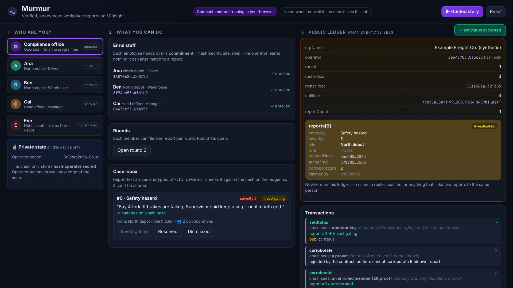

# Murmur

**Verified, anonymous workplace reports on Midnight.**

Staff prove *that* they work somewhere without revealing *who* they are. Each person can file one report per round, colleagues can corroborate anonymously, and the reporter can prove authorship later, on their own terms.

[**▶ Live demo**](https://northstar-trustrail.github.io/murmur/) (runs the compiled contract in your browser, no wallet needed) · [**Demo video**](https://northstar-trustrail.github.io/murmur/murmur-demo.mp4) · [**Slides (PDF)**](docs/murmur-slides.pdf)



### Evaluate in five minutes

1. Open the **[live demo](https://northstar-trustrail.github.io/murmur/)** and press **▶ Guided story**. Watch the *Public ledger* and *Transactions* panels on the right.
2. Read **[`contract/src/murmur.compact`](contract/src/murmur.compact)**: one file, about 180 lines, every `disclose()` deliberate.
3. `npm install && npm test`: 13 tests run against the compiled contract, including dishonest-client tests.

---

## The problem

Whistleblowing and safety hotlines force a bad choice:

* **Anonymous** channels (drop boxes, open web forms) get ignored or flooded. Nobody can tell a real employee from a disgruntled outsider or one person posting fifty times.
* **Identified** channels (HR email, named tickets) get the facts, but people don't use them because they fear retaliation. That fear is the main reason misconduct goes unreported.

Organisations need both at once: **proof that the reporter is a member, plus the guarantee that nobody can tell which member.** That combination is exactly what zero-knowledge proofs make possible, and Midnight's split between public and private state is built for it.

## What Murmur does

| Property | How the contract enforces it |
|---|---|
| **Only real members can report** | The operator enrols members as hiding commitments `hash(secret, site, role)` in a `HistoricMerkleTree`. Filing a report requires a ZK proof of a valid Merkle path to a known root. |
| **Nobody learns which member** | The commitment, the path and the secret stay in the member's private state (witnesses). Only the Merkle root reaches the ledger. |
| **Selective disclosure** | The reporter chooses to reveal their **site**, **role**, both, or neither. Whatever is revealed is *proven* to match the enrolled credential, so it can't be faked. |
| **No flooding** | A per-round nullifier `hash(secret, round)` limits each member to one report per round, without linking rounds. |
| **Anonymous corroboration** | Other members can vouch for a report once each (`hash(secret, reportId)` nullifier). The circuit also proves the corroborator **is not the author**, still without revealing who they are. |
| **Authorship on the reporter's terms** | Each report carries an unlinkable `authorTag = hash(secret, reportId)`. The author can later prove it and bind the report to a key they choose (a lawyer, an ombudsperson), once. |
| **Accountable operator** | Only the holder of the operator secret (whose hash is sealed at deploy time) can enrol, open rounds and move a case through *Received → Investigating → Resolved / Dismissed*. |

## Privacy model: what's public and what's private

```
 Member's device (private state)              Midnight public ledger
 ───────────────────────────────              ──────────────────────
 secret          ──┐                          operator      = hash(operatorSecret)   (sealed)
 site, role        ├─▶ memberLeaf ──(enrol)─▶ roster        = Merkle tree of commitments
 Merkle path     ──┘                          rosterSize, round
                                              nullifiers    = {hash(secret,round), hash(secret,id)}
 ZK proof: "I know a leaf in the roster,  ─▶  reports[id]   = category, severity, contentHash,
  this nullifier is mine, and the site/role                   site? role?, authorTag,
  I chose to show is the one I enrolled"                     corroborations, status, claimedBy
```

| Data | Where it lives |
|---|---|
| Member secret, Merkle path, which roster leaf | **Private.** Witness only; never disclosed |
| Site / role | **Private by default**, disclosed per report only if the reporter opts in |
| Report text | **Off-chain**, sent to the operator; only its SHA-256 hash is on chain, so tampering is detectable |
| Category, severity, status, corroboration count | Public |
| Nullifiers, author tags | Public but unlinkable: each is a domain-separated `persistentHash` of the secret with a different context |

Every `disclose()` in [`murmur.compact`](contract/src/murmur.compact) is deliberate: the compiler refuses to put witness-derived data on the ledger unless it is explicitly disclosed. A good review path is to read that file top to bottom (≈180 lines).

## Architecture

```
murmur/
├── contract/                  Compact contract + TypeScript bindings
│   ├── src/murmur.compact     the contract (6 provable circuits, 2 exported pure circuits)
│   ├── src/managed/murmur/    compiler output (JS bindings, ZKIR, contract-info)
│   ├── src/witnesses.ts       private state + witness implementations
│   ├── src/simulator.ts       in-memory deployment on @midnight-ntwrk/compact-runtime
│   └── src/test/              vitest suite (13 tests)
├── web/                       Vite demo app: runs the same compiled contract in the browser
└── docs/                      slides, screenshots
```

* **Contract** (Compact, language ≥ 0.23, built with compactc 0.35.0 / language 0.27.0 / runtime 0.20.0).
* **Witnesses**: `credential()`, `rosterPath(leaf)` (looked up from the public tree with `findPathForLeaf`), `operatorSecret()`.
* **Simulator**: each call builds a `CircuitContext` from the current public contract state and *the calling persona's own private state*, mirroring how each user's wallet supplies only their own secrets.
* **Web demo**: the browser bundles the compiled contract, the Compact runtime and the on-chain runtime WASM. Every button runs the real circuit logic, including the asserts, Merkle checks and nullifier sets. The public ledger panel is decoded with the generated `ledger()` function.

### Circuits

| Circuit | Who | Proves / does | ZKIR instructions | Prover key |
|---|---|---|---:|---:|
| `fileReport` | member | roster membership, fresh round nullifier, honest disclosure | 277 | 10.0 MB |
| `corroborate` | member | membership, fresh corroboration nullifier, *not the author* | 315 | 10.0 MB |
| `claimAuthorship` | author | knows the secret behind `authorTag` | 167 | 2.8 MB |
| `enroll` | operator | knows operator secret; inserts commitment | 115 | 2.8 MB |
| `advanceRound` | operator | knows operator secret | 45 | 2.8 MB |
| `setStatus` | operator | knows operator secret | 174 | 2.8 MB |

Numbers are from a full (non `--skip-zk`) compile with compactc 0.35.0. That compile generates all six prover/verifier key pairs offline in about 30 seconds.

## Run it

Requirements: Node.js ≥ 22 and the [Compact toolchain](https://docs.midnight.network/getting-started/installation) (only needed to recompile; the compiled output is committed).

```bash
git clone https://github.com/northstar-trustrail/murmur && cd murmur
npm install

npm test              # 13 simulator tests against the compiled contract
npm run typecheck
npm run dev           # demo at http://localhost:5173
npm run build         # static build in web/dist

# recompile the contract (uses `compact compile`; set COMPACTC=compactc to call the binary directly)
npm run compact       # JS bindings + ZKIR (fast, --skip-zk)
npm run compact:zk    # also generates prover/verifier keys
```

### What the tests cover

```
✓ publishes only the operator's key hash, the org name and round 1
✓ only the operator can enrol, advance rounds or set a status
✓ roster leaves hide the member: same site and role, different leaves
✓ discloses exactly the attributes the reporter opts into
✓ a member cannot lie about a disclosed attribute (the leaf would not be on the roster)
✓ a dishonest client that forges the Merkle path is rejected inside the circuit
✓ outsiders cannot file
✓ one report per member per round; a new round re-opens it
✓ rejects severities outside 1..5
✓ nothing on the ledger links two reports by the same member
✓ counts each member once and never the author
✓ a corroboration does not use up the member's own report for the round
✓ only the author can claim, once, to a key of their choice
```

The "dishonest client" test swaps in malicious witness code (a real path for a different credential, and a path relabelled with a forged leaf) to show the protection comes from the circuit's own asserts, not from honest client code.

## Demo walkthrough

Open the [live demo](https://northstar-trustrail.github.io/murmur/) and press **▶ Guided story**, or click through the personas yourself:

1. **Compliance office** (operator) enrols Ana, Ben and Cai. The ledger shows three commitments and a new Merkle root, but no names.
2. **Ana** files a severity-5 safety report and discloses only her site. The ledger gets the report; her role and identity stay hidden.
3. Ana tries again in the same round and is **rejected** (nullifier). **Eve**, who isn't on staff, is **rejected** (no valid Merkle path).
4. **Ben** and **Cai** corroborate anonymously. Ana tries to corroborate her own report and is **rejected**.
5. The operator reads the text, checked against the on-chain hash, and opens an investigation.
6. Ana proves authorship to a key she chooses, then the case is resolved.

The *Transactions* panel shows, for every call, what the chain sees ("an enrolled member (ZK proof)") next to who actually acted. Only the demo knows the latter.

## Who it's for

Logistics, manufacturing, healthcare and retail employers with hotline obligations (e.g. the EU Whistleblower Directive, SOX-style ethics lines). Also unions, universities, and any member organisation that needs credible, abuse-resistant anonymous feedback. Rough business model: per-seat SaaS for the operator console, with the contract as the neutral, auditable core that neither the vendor nor the employer can quietly edit.

## Progress this wave (Wave 2)

Murmur is a new project started in this wave. Everything here was built in Wave 2:

* Designed and implemented the Compact contract (membership proofs, selective disclosure, nullifiers, anonymous corroboration with an author-exclusion proof, delayed authorship claims, operator workflow).
* Compiled cleanly with the latest toolchain (0.35.0), including full ZK key generation.
* Built a TypeScript simulator on `@midnight-ntwrk/compact-runtime` 0.20.0, plus a 13-test vitest suite including adversarial-witness tests.
* Shipped a browser demo that runs the compiled contract client-side, with a guided story, a private vs public state view and a per-transaction disclosure log.
* Wrote the README, slide deck and demo video.

## Limitations and roadmap

Being upfront about what this is and isn't yet:

* **Not yet deployed to a live network.** The demo and tests run the compiled contract against the Compact runtime locally. Proof generation needs a proof server; the next step is a Preprod deployment with the Midnight proof server and Lace wallet integration via the DApp connector.
* **Report text delivery** is simulated in the demo. In production it would be encrypted to the operator's public key and stored off-chain, with the on-chain `contentHash` as the integrity anchor.
* **Operator trust.** The operator could enrol fake members. `rosterSize` is public so employees and auditors can compare it with headcount; a roadmap item is multi-party enrolment (e.g. HR + works council co-sign).
* **No revocation yet.** `HistoricMerkleTree` accepts past roots, so departed staff keep membership. Planned: epoch-based roster rotation, where each round only accepts roots from the current epoch.
* **Small-group anonymity.** Disclosing site *and* role at a tiny site can identify someone. Planned: the UI warns when a disclosed attribute set covers fewer than *k* enrolled members (the operator can publish per-site counts).

## Built with Midnight

Murmur is built on the [Midnight Network](https://midnight.network): the [Compact](https://docs.midnight.network/compact) language and compiler, and `@midnight-ntwrk/compact-runtime`. The Midnight docs' [Merkle-tree authentication example](https://docs.midnight.network/concepts/how-midnight-works/keeping-data-private) inspired the membership-proof pattern.

## License

[Apache-2.0](LICENSE). All data in the demo, video and slides is synthetic.
